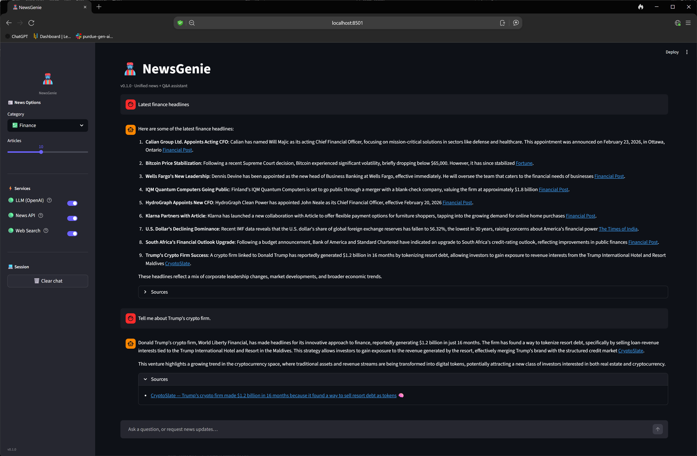
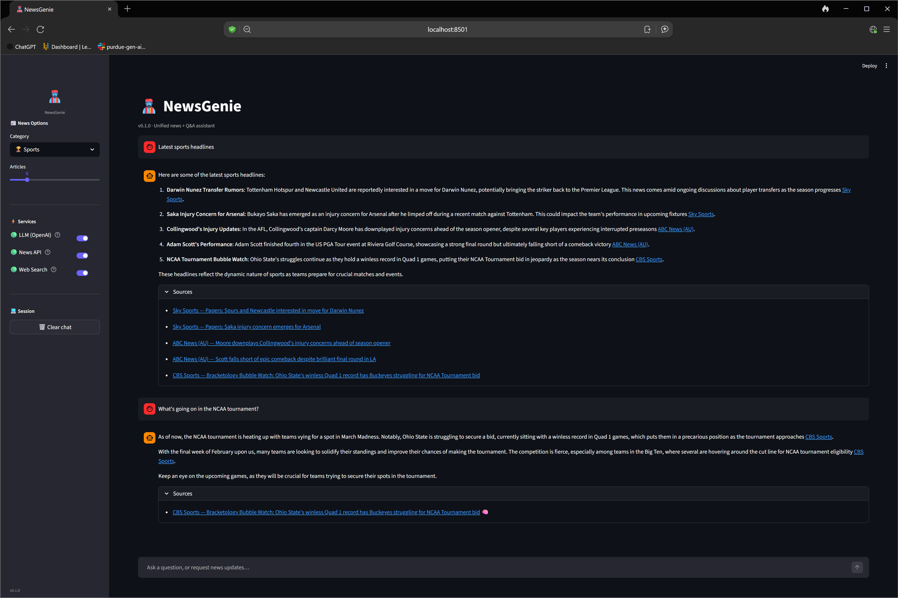
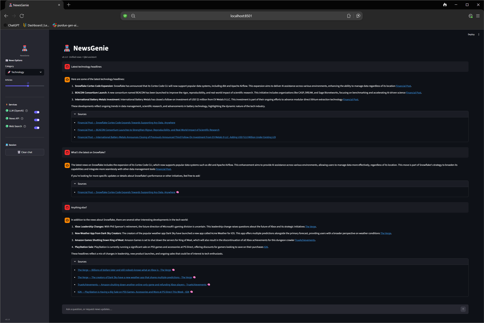

# NewsGenie 🧞‍♂️🗞️ — AI-Powered News + Information Assistant

| | | |
| :---: | :---: | :---: |
|  |  |  |

A deployable scaffold for **NewsGenie**, a unified assistant that:

- answers general questions,
- fetches **real-time news** by category/topic,
- optionally **verifies** claims via web search,
- routes everything through a **LangGraph** workflow,
- ships with a **Streamlit** UI,
- includes robust **fallbacks**, caching hooks, and error transparency.

> This repo runs out-of-the-box in **demo mode** (no API keys required),
> and becomes fully real-time once you add keys in `.env`.

## Quickstart (local)

### 1) Create and fill `.env`

```bash
cp .env.example .env
# then edit .env
```

### 2) Install + run (pip)

```bash
python -m venv .venv
source .venv/bin/activate  # Windows: .venv\Scripts\activate
pip install -r requirements.txt
streamlit run app.py
```

## Quickstart (Docker)

```bash
docker compose up --build
```

## Environment variables

| Variable | Purpose | Required |
| --- | --- | --- |
| `AZURE_OPENAI_API_KEY` | Azure OpenAI key | optional¹ |
| `AZURE_OPENAI_ENDPOINT` | Azure OpenAI endpoint (base URL) | optional¹ |
| `AZURE_OPENAI_API_VERSION` | Azure API version | optional (default `2023-12-01-preview`) |
| `AZURE_OPENAI_DEPLOYMENT` | Azure deployment / model name | optional¹ |
| `OPENAI_API_KEY` | Standard OpenAI key (ignored when Azure is set) | optional¹ |
| `OPENAI_API_BASE_URL` | Base URL for OpenAI-compatible API | optional (default `https://api.openai.com`) |
| `LLM_MODEL` | Model name (standard OpenAI) | optional (default `gpt-4.1-mini`) |
| `NEWS_API_KEY` | News API key (e.g., newsapi.org) | optional (demo mode works) |
| `SEARCH_API_KEY` | Web search key | optional |
| `SEARCH_API_BASE_URL` | Base URL for search provider | optional |
| `NEWS_COUNTRY` | News region (e.g. `us`) | optional (default `us`) |
| `NEWS_LANG` | News language (e.g. `en`) | optional (default `en`) |
| `CACHE_TTL_SECONDS` | Cache TTL for news/search | optional (default `180`) |
| `NEWS_MAX_ARTICLES` | Max articles slider upper bound | optional (default `20`) |
| `DEMO_MODE` | Force demo mode (`auto`/`true`/`false`) | optional (default `auto`) |
| `LOG_LEVEL` | Logging level (`DEBUG`/`INFO`/`WARNING`…) | optional (default `INFO`) |

¹ Set **either** the Azure group or `OPENAI_API_KEY`. Azure takes priority when both are present.

## Repo layout

```text
app.py                     # Streamlit UI
newsgenie/
  __init__.py              # package root + version
  config.py                # env + defaults
  schema.py                # typed state + routing contracts
  workflow.py              # LangGraph graph
  llm.py                   # LLM wrapper (demo + OpenAI-compatible)
  tools/
    news.py                # News API tool (demo + live)
    search.py              # Web search tool (demo + live)
    trust.py               # source ranking + heuristics
  util/
    cache.py               # TTL cache abstraction
    errors.py              # error types
tests/
  test_cache.py
  test_intent.py
  test_llm.py
  test_search.py
  test_trust.py
Dockerfile
docker-compose.yml
requirements.txt
pyproject.toml
VERSION
.env.example
.streamlit/config.toml
.gitignore
.dockerignore
```

## License

MIT for the scaffold. Replace as needed.
